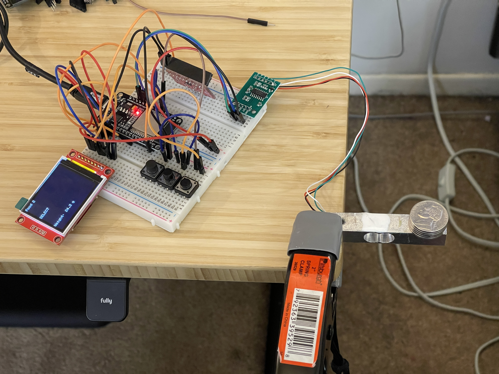

#Scale for Measuring Carbs

1. Features
2. Materials
3. To Do
4. Updates
5. Notes
6. References
---

## 1 Features

#### v1.0
- Weigh food to display carbs
- Add/Remove/Update foods via web interface
- Rechargable battery
- Deep Sleep / Wake on touch

---

## 2 Materials

- ESP32
- LCD Display
- 3D Printed case/enclosure
- Rotary encoder
- Tactile buttons (Temporary?)
- MPR121 capacitive buttons (Easy clean front)
- 3x18650 Battery Pack
- Strain gauge load cell
- HX711 24-bit ADC
- TP4056 Lipo charger

---

## 3 To Do

- [x] **HARDWARE:** Wire up and test LCD
- [ ] ~~**HARDWARE:** Wire up and test rotary encoder~~
- [x] **HARDWARE:** Wire up and test buttons
- [ ] **HARDWARE:** Add hardware debouncing for all buttons
- [ ] **HARDWARE:** Wire up and test MPR121
- [x] **HARDWARE:** Wire up and test load cell and 24bit ADC
- [x] **CODE:** Create github repo
- [x] **CODE:** Create and test Arduino project
- [x] **CODE:** Connect ESP32 to Wifi
- [ ] **CODE:** Setup webserver
- [ ] **DESIGN:** Design web interface
- [ ] **DESIGN:** Design LCD UI
- [ ] **DESIGN:** Design and layout Physical UI
- [x] **CODE:** Add Calibration functions
- [ ] **CODE:** Add Tare function
- [ ] **CODE:** Read raw ADC Val
- [ ] **CODE:** Display Foods for user to select
- [ ] **CODE:** Prompt User to select food
- [ ] **3D Print:** Deisgn 3D prited enclosure
- [x] **3D Print:** Design/Add Load Cell model to Project
- [x] **3D Print:** Design/Add LCD model to Project
- [ ] **3D Print:** Design/Add ESP32 model to Project
- [ ] ~~**3D Print:** Design/Add Rotary encoder model to Project~~
- [ ] **3D Print:** Design/Add Load Cell model to Project
- [ ] **3D Print:** Design/Add Momentary switch model to Project
- [ ] **3D Print:** Design/Add Battery model to Project
- [ ] **3D Print:** Design/Add TP4056 model to Project
- [ ] **3D Print:** Design/Add HX711 model to Project
- [ ] **3D Print:** Design/Add MPR121 model to Project
- [ ] **HARDWARE:** Layout breadboard circuit

---

## 4 Updates

### 12/28/22
Began project in ernest. Doing it "right" this time by starting with a written plan (this markdown file) instead of jumping right in with hardware and adding code as neeeded. Hopefully a well thought out plan will keep me from acruing tiny mistakes and inefficiencies over time that will eventually turn into road blocks and points of stress down and make me not want to continue with the project. 

### 12/29/2022

Added the load cell and 24bit ADC (HX711). Might want to rethink using the HX711 as the version I have uses some proprietary, though open, data protocol. The newer version from DFRobot uses a trus I2C interface so I wonder if that will be more reliable.

I used some US coins to calibrate and test the load cell. I'm getting fairly accurate results. Most measurements are within 0.2g so I'm pretty happy with that.

I updated the code for the LCD to display the measure weights and it seems to be running well.

Here's the state of the prototype after the second day.

### 12/30/2022

Started designing the housing. Got as far as the main body and the weight plate. Printed out the area where the load cell connects to the main housing and plate to test fit. Fit perfectly on the first try.

Also designed models for the load cell and TFT display to include in the model.

---

## 5 Notes

- Foods
  - List of foods should be stored as a CSV.
  - For now we're not going to worry about classifying the foods as breakfast, lunch, snack, etc.
- Rotary Encoder
  - The only rotary encoder I had didn't have the expected pinout. After messing with it for about an hour, one of the pins broke off. I decided to just use 3 momentary pushbuttons instead of 

---

## 6 References

